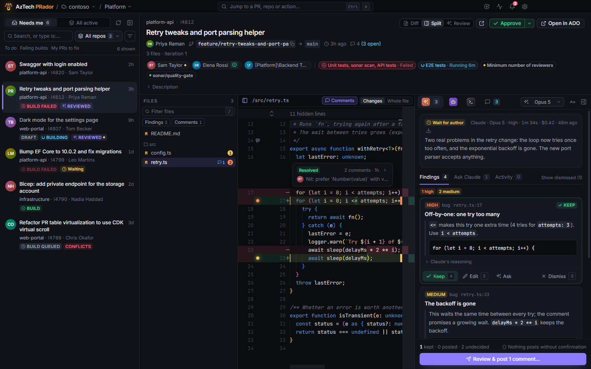

# AzTech PRador

A dark-mode Windows app for reviewing pull requests on **Azure DevOps** and **GitHub**, with an AI reviewer at your side: **Claude**, **GitHub Copilot** or **OpenCode**.

- **Your PRs at a glance**: the ones waiting on you, or every active one, with build status, votes and filters.
- **AI reviews**: an agent reads a checkout of the PR, only reads, and finds what's worth your time. You keep, edit or dismiss each finding.
- **Ask about anything**: a finding, the whole PR, or a few lines of the diff.
- **Comments and votes** from the app. **Nothing is ever posted without your confirmation**: every write shows exactly what will change first.
- **Fix mode** for your own PRs: an agent fixes what the review found in your checkout, and you commit and push when you're happy.
- **Notifications** for review requests, new PRs in repos you watch, and replies to your comments.

## Start here

1. [Getting started](getting-started.md): install, sign in, set up an agent, run your first review.
2. [Your data and privacy](privacy.md): what stays on your machine, and what goes where.

## Using the app

- [Pull requests](pull-requests.md): the list, filters, builds, projects, the diff, Azure DevOps and GitHub.
- [Reviews](reviews.md): running a review, the findings, posting and votes.
- [Asking the agent](ask.md): questions about a finding, the PR, a thread or some lines.
- [Comments](comments.md): threads, replies, and commenting on code.
- [Fix mode](fix-mode.md): an agent fixing your own PR in your checkout.
- [Notifications](notifications.md): the bell, Windows notifications, watched repos, the tray.
- [Keyboard](keyboard.md): shortcuts and the command palette.
- [Updates](updates.md): how the app updates itself, and what's new.

## How to

- [Re-review after a push](how-to/re-review-after-a-push.md)
- [Ask about some lines of the diff](how-to/ask-about-lines.md)
- [Fix your own PR](how-to/fix-your-own-pr.md)
- [Tell reviews what to look for](how-to/focus-areas.md)
- [Get notified about new PRs in a repo](how-to/watch-a-repo.md)
- [Review GitHub pull requests](how-to/use-github.md)

## When something's wrong

- [Troubleshooting](troubleshooting.md)
- [FAQ](faq.md)
