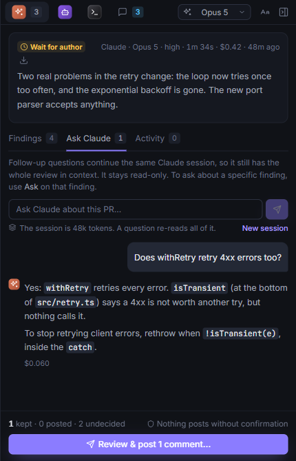

# Asking the agent

Ask the agent that reviewed the PR about anything: a finding, the PR as a whole, a comment thread, or some lines of the diff. It answers from the code, read-only, the same way it reviews.

## About the review or a finding

- **The whole PR**: the **Ask** tab of a review ("Does this retry 4xx errors too?").
- **A finding**: the question box on the finding ("Is this really reachable?"). **Use as comment** puts the answer in the finding's comment, for you to edit before you post.

The agent carries on from its review, so it remembers what it read and found. If the PR has new commits since, it knows that, and reads the new code when the question needs it.

## About some lines of the diff

Select lines in the diff and right-click → **Ask AI about these lines**, or use the **Ask** button (**Ask Claude**, say) in the diff's comment box. The question goes with the file, the lines and their code. Pick the agent in the box. The answer shows on that agent's **Ask** tab. See [Ask about some lines](how-to/ask-about-lines.md).

## About a comment thread

**Ask AI** on a thread offers:

- **Is this right?**: checks what the comment says against the code.
- **How would I fix it?**
- **Draft a reply**: **Use as reply** puts the answer in the thread's reply box.

Or ask your own question. The thread goes along: where it is and who said what. See [Comments](comments.md).

## Without a review

An agent that hasn't reviewed the PR can still answer: it's marked **new** in the picker. Your first question starts a **questions session**. The agent works in the PR's checkout, read-only, with the PR as context but no review. Later questions continue it, and a review by that agent later takes the questions and answers over. A questions session doesn't mark the PR as reviewed.

The start screen of a review tab can ask a question too, without a review.

## What a question costs

Each answer shows what it cost. A question carries on the agent's session, so it re-reads the whole session.

The line under the Ask box shows how big the session is and, for Claude and Copilot, how much longer the provider keeps it cached:

- **Cached for about N more minutes**: a question now re-reads it cheaply.
- **No longer cached**, in amber: the cache has expired (for Claude with an API key, about five minutes after the last question), and the next question pays to read the whole session again.

**New session** leaves the session behind, after a confirmation, since it can't be undone. The next question starts a session that knows only the PR: not the review, its findings or what the agent read. The questions and answers so far are cleared. It's useful when a big session's cache has expired and you just have a quick question.
