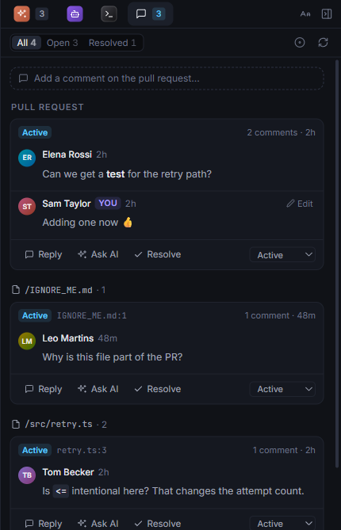
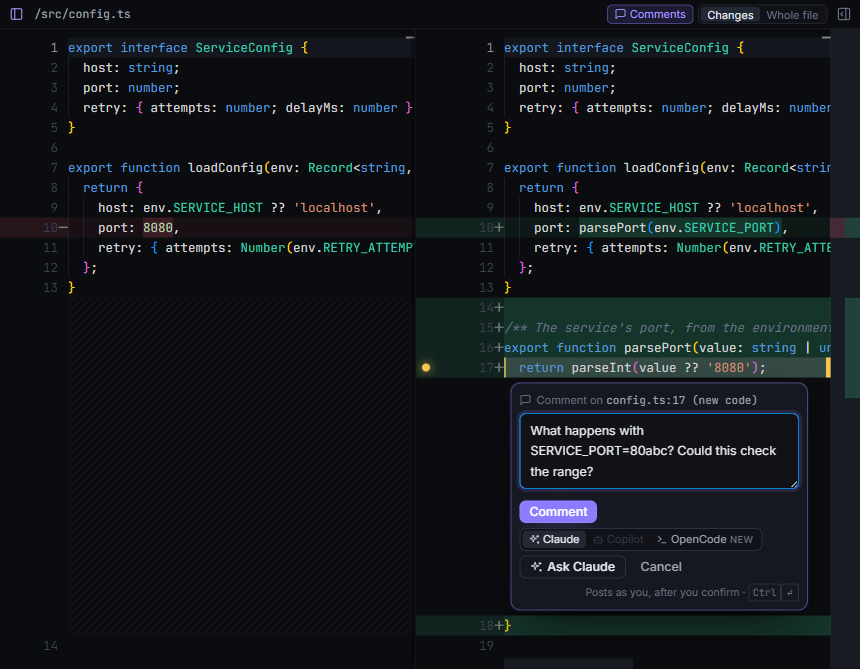

# Comments

## The PR's threads

The **Comments** tab of the panel lists every thread on the PR, yours included: who said what, the replies, and the thread's status. Click a thread's `file:line` to see its lines in the diff.

From here you can:

- **reply** to a thread;
- **resolve** it, or reactivate it (on Azure DevOps there are other statuses too, such as won't fix);
- **edit** your own comments;
- write a **new comment** on the PR.

Each of these shows a confirmation with exactly what will change before anything is posted.

**Ask AI** on a thread asks an agent about it. See [Asking the agent](ask.md#about-a-comment-thread).

## Threads in the diff

Threads also show in the diff, under their lines, the way Azure DevOps shows them. You can reply, resolve and edit there too. The **Comments** toggle above the diff hides them.

While the Comments tab is open beside the diff, the diff only marks the threads' lines with a speech bubble in the margin; click it to pick that thread in the tab.

On GitHub, a thread on code that has changed since shows with its file, not on a line of the new version. Azure DevOps moves threads along with the code where it can; one it can't place stays at its original lines.

## Comment on code

1. Hover over a line in the diff and click the **+** in the margin.
   For several lines, select them and click the **+** on one of them, or press <kbd>C</kbd>. It's in the right-click menu too.
2. Write the comment.
3. Post it, and confirm. The comment lands on the same lines in Azure DevOps or GitHub.

You can comment on new code and, side by side, on deleted lines. Lines you pick on the old side that the PR didn't change go on the new code, at their new line numbers.

The comment box's **Ask** button (**Ask Claude**, say) sends your text to the agent as a question instead. See [Ask about some lines](how-to/ask-about-lines.md).
