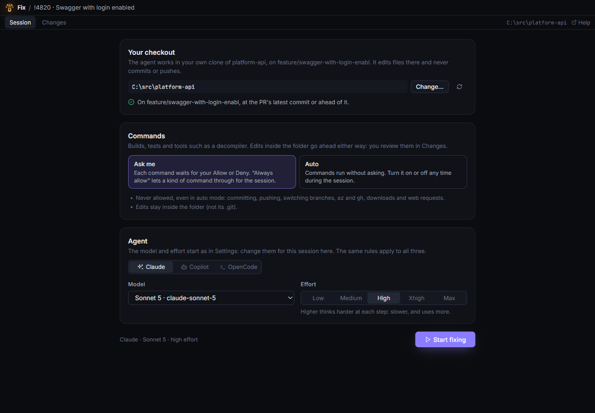
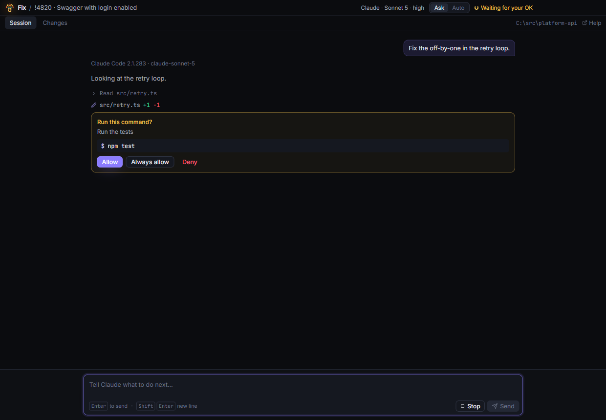
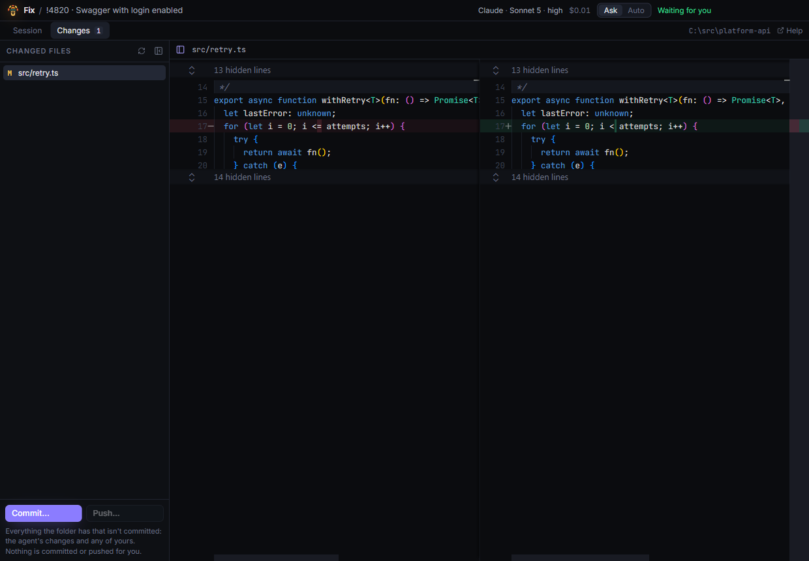

# Fix mode

For your own PRs: an agent fixes what the review found, or what a reviewer asked for, in **your own clone** of the repository. You see every change, and you commit and push when you're happy.

**Fix…** is in the header of PRs you created. It opens a window of its own. **Help**, in that window, opens this page.

## Set it up

1. **Link your checkout…**: pick the folder of your clone. You do this once for each repository.
   The app checks that the folder is a clone of the PR's repository, on the PR's branch, with its latest commit (commits of yours that aren't pushed yet are fine). If files have uncommitted changes, it says so, and **Start fixing** waits until you tick **Start anyway**: the agent's changes would mix with yours.
2. Pick the **agent** (Claude, Copilot or OpenCode, among those set up on this machine), its **model** and **effort** for this session. They start as in Settings.
3. Pick how commands are approved:
   - **Ask me**: each command waits for your OK.
   - **Auto**: commands run without asking. You can switch this on or off at any time in the session.
4. **Start fixing**.

## Tell it what to fix

Write in the box at the bottom, like a chat: "fix the findings", "do what Tom asked in the comments", "the off-by-one in retry.ts". The agent knows the PR, the reviews' findings and the open comment threads.

- **Edits** to files in your folder go ahead.
- **Commands** (a build, the tests, a code generator) wait for **Allow** or **Deny**. **Always allow** lets commands that start the same way through for the rest of the session. In **Auto** mode, they run without asking. Commands that only read, such as listing files, run without asking, marked "read-only".
- **Blocked**, even in Auto mode:
  - git commands that change anything: committing, pushing, switching branches, `add`, `stash`, `reset` and the like (reading, such as `git diff` or `git log`, is fine);
  - the Azure and GitHub command-line tools (`az`, `gh`);
  - downloads, web requests and remote connections (`curl`, `ssh`, …);
  - publishing packages (`npm publish`, say).

  This check is best effort: a command can be written in ways it doesn't recognize. That's why commands ask first. Turn on Auto only when you trust what the agent will run.

Scrolled up? The button at the bottom (or <kbd>End</kbd>) goes back to the latest message.

## Commit and push

The **Changes** tab shows what changed in your folder, file by file. <kbd>F</kbd> hides the list of files, and you can drag its edge to resize it.

- **Commit…**: pick the files. A message is suggested, and you can change it.
- **Push…**: shows the commits and files that will be pushed, and pushes after you confirm. It never force-pushes.

Both wait while the agent is working. The agent never commits or pushes itself: only you do, with these buttons.

## Check the fixes

After a push, **Re-review the changes** reviews what changed since the review, and checks whether the findings are fixed. The agent that reviewed the PR does it: the fixing agent if it did, with the session's model and effort; otherwise the agent that did, with its own model and the session's effort. The button's tooltip says which. The re-review shows in the main window.

See [Fix your own PR](how-to/fix-your-own-pr.md) for a walk-through.
