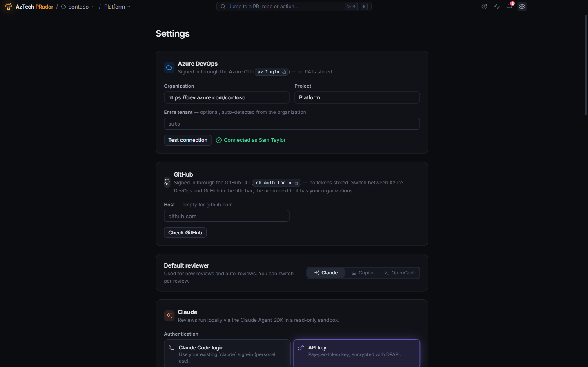

# Getting started

## Install

1. Download **`AzTech-PRador-Setup-<version>.exe`** from the [latest release](https://github.com/mtomorowicz/AzTech-releases/releases/latest).
2. Run it and follow the steps. Installing **only for me** needs no admin rights.

The installer isn't code-signed, so Windows may say "Windows protected your PC". Choose **More info → Run anyway**.

The app [updates itself](updates.md) from then on.

## Requirements

- **Windows 10 or 11** (x64).
- **[git](https://git-scm.com/downloads)** on your PATH: reviews read a local checkout of each PR.
- For **Azure DevOps**: the **[Azure CLI](https://learn.microsoft.com/cli/azure/install-azure-cli)**, signed in with `az login`.
- For **GitHub**: the **[GitHub CLI](https://cli.github.com/)**, signed in with `gh auth login`.
- For reviews, at least one agent:
  - **Claude**: an Anthropic API key.
  - **GitHub Copilot**: a GitHub account with Copilot.
  - **OpenCode**: a provider connected in OpenCode (OpenAI, Google, Anthropic, a local model, and many more).

The app signs in through these tools. It stores no Azure DevOps password or token of its own.

## Connect to your pull requests

The first time it starts, the app opens Settings and asks where your pull requests are. Set up Azure DevOps, GitHub, or both:

- **Azure DevOps**: enter your **Organization** (its name, or `https://dev.azure.com/<your-org>`) and the **Project**. If `az` isn't signed in yet, the app says so, with the command to run: `az login`.
- **GitHub**: click **Check GitHub**, then pick an **Organization** (or your own account). The app uses your `gh` sign-in. For GitHub Enterprise, set the host there first.

Set up an agent (below), then click **Continue**.

With both set up, the title bar switches between Azure DevOps and GitHub, and you land where you last were on each. See [Pull requests](pull-requests.md).

## Set up an agent

Open **Settings** (the gear in the title bar). Each agent has its own section.

- **Claude**: choose **API key**, paste your Anthropic key and click **Save key**. It's encrypted on your machine.
- **GitHub Copilot**: choose **GitHub sign-in** (your Copilot CLI or GitHub CLI login, enterprise accounts included) or **GitHub token** (paste a fine-grained token with the Copilot Requests permission and click **Save token**), then **Check Copilot**. It lists the models your plan offers.
- **OpenCode**: connect a provider in OpenCode first (`opencode auth login`, once for each), then **Check OpenCode**. It lists the models you've connected. No OpenCode on your machine? **Sign in…** opens the copy the app uses.

Each agent has a default **model** and **effort**: higher effort thinks harder, and takes longer and costs more. **Default reviewer** picks the agent new reviews start with.

Then click **Save changes** at the bottom (**Continue** the first time). Your choices, such as **API key** for Claude, are kept only then; the key and token are saved by their own buttons.

Each agent needs its runtime, about 40–110 MB, downloaded once and kept: Claude's with its first review, Copilot's and OpenCode's when you check them in Settings or open their tab. An update of the app sometimes brings a newer one.

## Your first review

1. Pick a PR in the list on the left. **Needs me** shows the ones waiting on you.
2. In the panel on the right, check the agent, model, effort and focus, then **Start review** (or press <kbd>R</kbd>).
3. The agent reads the PR's changes in a checkout of its own. Only reads: it can't change anything. You see what it's doing as it goes.
4. When it's done, go through the **findings**: **Keep**, **Edit** or **Dismiss** each one (<kbd>A</kbd>, <kbd>E</kbd>, <kbd>D</kbd>; <kbd>J</kbd> / <kbd>K</kbd> move between them).
5. **Review & post** shows exactly what will go on the PR: the comments you kept, an optional summary and an optional vote. Nothing is posted until you click **Post**.

More in [Reviews](reviews.md).
