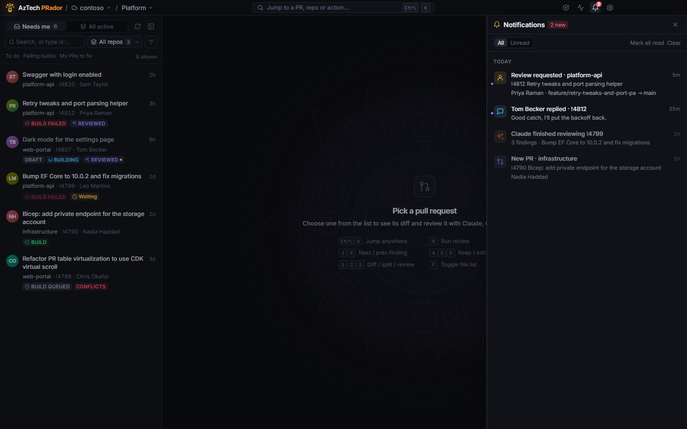

# Notifications

## The bell

The bell in the title bar lists what happened while you were busy. Click one to go to its PR, or straight to the thread.

You're told when:

- you're added as a reviewer on a PR, in any repository;
- a PR is opened in a repository you **watch**;
- someone replies in a thread you commented in;
- someone else resolves a thread you commented in;
- an automatic review has finished;
- a review you started finishes, or fails, while its PR isn't on screen.

Settings → Notifications has a switch for each of the first four. Each also shows as a Windows notification while the app is running, including from the tray.

**Send test notification** in Settings checks they get through. If you don't see it, check Windows Settings → System → Notifications, and Do not disturb.

Drafts: new drafts aren't announced unless you turn on **Include new drafts**. Otherwise you're told when a draft is published.

## Watch a repository

Open the repository menu above the PR list (it says **All repos** until you pick one) and click the bell next to a repository. New PRs in it are announced. Watched repositories are listed in Settings → Notifications, and remembered per project. See [Get notified about new PRs in a repo](how-to/watch-a-repo.md).

## Automatic reviews

Turn on **Automatically review new PRs with your default reviewer** in Settings → Notifications. It needs **New pull requests in watched repositories** on. New PRs in watched repositories are then reviewed as they arrive, in the background, and the notification tells you when the findings are ready.

Automatic reviews use your default agent, model, effort, focus and budget cap. A draft that was reviewed and is then published gets a review of just what changed. Later pushes to a PR aren't reviewed on their own: use **Review new changes** (see [Re-review after a push](how-to/re-review-after-a-push.md)).

They only produce findings. **Nothing is posted**: you go through them and post as usual.

## The tray

When you close the window, the app keeps running in the system tray, so notifications keep coming. The tray icon gets a dot when some are unread; hover over it for how many. To quit, right-click the tray icon → **Quit AzTech PRador**. To quit when you close the window instead, turn off **Keep AzTech PRador running in the system tray when the window is closed**, near the bottom of Settings.

**Start AzTech PRador in the tray when Windows starts**, next to it, starts it when you sign in to Windows, so you're told about PRs from the start of the day.
