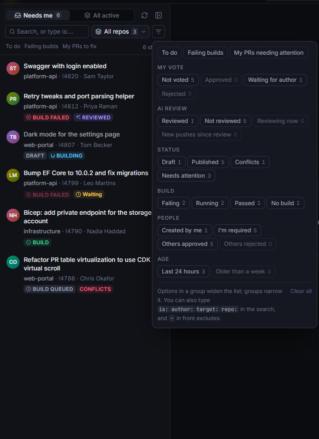

# Pull requests

## The list

The list on the left has two tabs:

- **Needs me**: PRs where you're a reviewer, whether you've voted yet or not. On GitHub: PRs asking for your review, plus the ones you've reviewed.
- **All active**: every active PR, drafts included, in all the project's repositories or the one you pick in the repository menu above the list (it says **All repos** until you pick one).

Each row shows the title, repository, author, how long ago it was opened, a **Draft** badge, your vote, and the PR's builds (failed, building, queued or passed; dimmed when they ran on an earlier version). A **Reviewing** badge means an agent is on it now; **Reviewed** means it's been reviewed, with a dot when the author has pushed since.

<kbd>Ctrl</kbd>+<kbd>B</kbd> collapses the list to a narrow rail that still marks failed and running builds. Drag the list's right edge to make it wider or narrower (double-click the edge for the default width).

### Filters

The filter button next to the repository menu filters by:

- **your vote**: not voted, approved, waiting, rejected;
- **AI review**: reviewed, not reviewed, new pushes since the review;
- **status**: draft, published, conflicts, needs attention;
- **build**: failing, running, passed, none;
- **people**: created by me, I'm required, others approved or rejected;
- **age** and **target branch**.

Each option shows how many PRs it matches. Options in one group add to the list, and groups narrow it. <kbd>Alt</kbd>+click an option to leave those PRs out instead. The presets **To do**, **Failing builds** and **My PRs needing attention** are a click away, in the menu and in the row under the search box (where the last one is **My PRs to fix**).

You can type the same filters in the search box, with suggestions as you go:

| Type | To see |
|---|---|
| `is:unvoted` | PRs you haven't voted on |
| `is:failing` | PRs with a failing build |
| `author:me` | your PRs |
| `author:"Priya Raman"` | someone else's |
| `target:release/*` | PRs into a release branch |
| `repo:api` | PRs in repositories with "api" in the name |
| `-is:draft` | a `-` in front leaves them out |

Each tab keeps its own filters, and they're remembered when you restart. When the filters hide every PR, the list says how many are hidden and offers **Clear filters**.

### Staying up to date

The list is re-read every minute. You can change that with **Auto-refresh PR list** near the bottom of Settings, or turn it off (0). Builds come with it every few minutes, and more often while one is queued or running.

When the PR you have open changes, it updates in place: title, description, votes, builds and comments. New commits bring the diff along, with the same file open at the same place. If you're typing a comment in the diff, the new commits wait: the header says **New commits · Show them**.

The app also catches up when your machine wakes, when the network comes back, and when you come back to the window. <kbd>F5</kbd> refreshes now.

## Projects and organizations

Click the project's name in the title bar (or <kbd>Ctrl</kbd>+<kbd>K</kbd> → "Switch project…") to pick another project in your organization. Recent ones come first, and you can type to search. The list, repositories and notifications follow the project you pick.

## Azure DevOps and GitHub

The title bar switches between Azure DevOps and GitHub. You land where you last were on each. The first time on GitHub, you pick an organization (or your own account).

Everything works the same on both, with GitHub's words for things:

- Votes are GitHub's reviews: approve, or request changes. GitHub doesn't let you review your own PR, so you can't vote on it.
- Builds are GitHub's checks (check runs and commit statuses), with the required ones marked.
- A review's comments go on the PR as one GitHub review.
- PRs are numbered `#42` rather than `!42`.

The app uses your GitHub CLI sign-in (`gh auth login`). For GitHub Enterprise, set the host in Settings → GitHub.

## A pull request

### The header

The header has the PR's title, branches, author and reviewers with their votes, and its builds.

- Click the **source branch** to copy its name.
- Click a **build** to see its pipeline run: where it stopped, its first errors, and a link to it.
- **Approve** votes on the PR. The menu next to it has the other votes: approve with suggestions, wait for author, reject, or reset your vote (on GitHub: request changes). Every vote shows a confirmation first.
- The **layout** buttons switch between **Diff**, **Split** and **Review** (<kbd>1</kbd>, <kbd>2</kbd>, <kbd>3</kbd>): the diff alone, the diff and the panel side by side, or the panel alone.
- **Open in ADO** (or **Open in GitHub**) opens the PR in your browser.

### The diff

The diff shows the old and new versions side by side. <kbd>W</kbd> switches between only the changes and the whole file. <kbd>F</kbd> shows or hides the file list.

**Filter the files** with the box at the top of the file list, or press <kbd>/</kbd> from anywhere:

- Words match anywhere in the path, and every word has to match.
- `*.cs` matches file names, and `Migrations/*` or `tests/**` match folders.
- A `-` in front leaves files out: `-test -package-lock.json`.
- The toggles under the box show only added (**A**), modified (**M**), deleted (**D**) or renamed (**R**) files, or files with **Findings** or open **Comments**.
- <kbd>↑</kbd> / <kbd>↓</kbd> open the previous or next file in the list, and <kbd>Esc</kbd> clears the filter.

### In a window of its own

The pop-out button in the header moves the PR into a window of its own, with its diff, review, comments and votes. Put it on another screen and keep working on other PRs in the main window. **Pin back** brings it back to the main window.

### Text size

The review and comments panel has its own text size: the **Aa** button in its header, or <kbd>Ctrl</kbd> + scroll over it.
