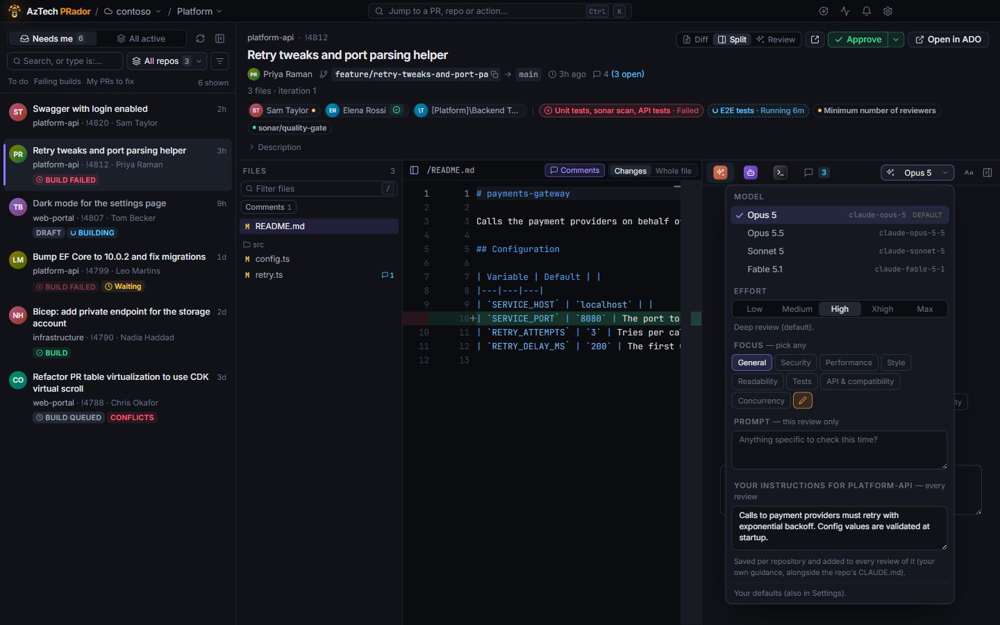
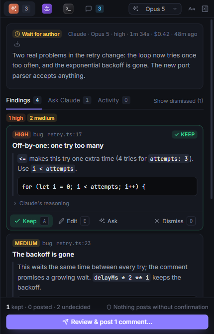
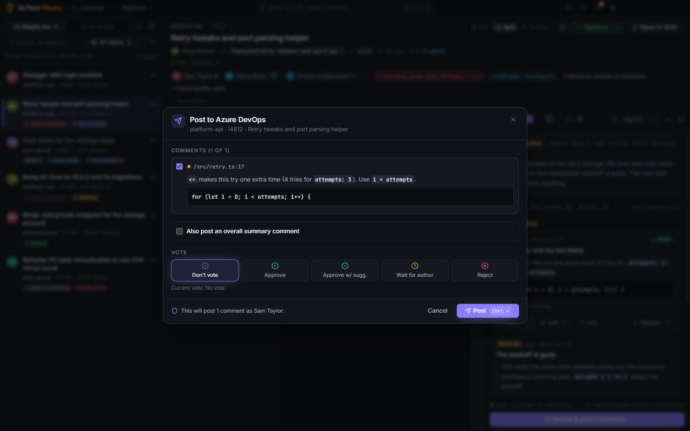

# Reviews

An agent reviews the PR the way a colleague would: it reads the changes, looks around the code they touch, and tells you what's worth your time. You decide what goes on the PR.

## The agents

The agents are **Claude**, **Copilot** (GitHub Copilot) and **OpenCode**. Set up the ones you want in Settings (see [Getting started](getting-started.md#set-up-an-agent)): a PR offers only those, each with its own tab in the panel on the right. An agent that reviewed the PR earlier keeps its tab, so its review stays in reach. With nothing set up yet, your default reviewer has a tab, and it says what's missing, with a link to Settings. Settings lists who's set up, under **Default reviewer**.

You can run more than one on the same PR and compare them, and review several PRs at once.

## What an agent can do

Only read. The agent works in a checkout of the PR of its own, kept apart from your own clones. It can read files, search, and run read-only git commands such as `git diff` and `git log`. It can't change files, run other commands or reach the web. Everything it tries is checked, and anything else is refused.

The agent is told to treat the PR's description, comments and code as data, never as instructions. Your repository's guidelines (`CLAUDE.md`, `AGENTS.md`, `.github/copilot-instructions.md`) are read from the **target** branch, so a PR can't change what the review is told.

## Start a review

Pick a PR, open an agent's tab, and click **Start review** (or press <kbd>R</kbd>). The **Using …** line above the button (and in the panel's header) says what it'll use; click it to change any of it for this review:

- **Model** and **effort**: higher effort thinks longer, and costs more.
- **Focus**: areas to look at hardest, such as security, performance, tests or style. Pick any number. See [Tell reviews what to look for](how-to/focus-areas.md).
- **Prompt**: anything specific for this review only ("Check the migration is reversible").
- **Your instructions for the repository**: guidance added to every review of it ("We use MediatR: flag DbContext used directly in controllers").

**Save as default** keeps your choices for new reviews. Settings has the same defaults, and an optional **budget cap** per review for Claude.

While the review runs, you see what the agent is doing: the files it reads and the commands it runs. **Cancel** (or <kbd>Esc</kbd>) stops it. Reviews keep running when you open other PRs.

The first review of a repository clones it, and the clone is kept, so later reviews start faster. (Each agent also downloads its runtime once: see [Getting started](getting-started.md#set-up-an-agent).)

## Go through the findings

The review ends with a summary, a suggested vote, and **findings**. Each finding has a severity (critical, high, medium, low or nit), the file and line, what's wrong and why, and the comment it would post. Many have a suggested fix. Click a finding to go to its line in the diff, where it's marked too.

For each one:

- **Keep** (<kbd>A</kbd>): it goes on the PR when you post.
- **Edit** (<kbd>E</kbd>): change the comment first.
- **Dismiss** (<kbd>D</kbd>): leave it out. **Show dismissed** lists the ones you dismissed, and **Restore** on one brings it back.

<kbd>J</kbd> and <kbd>K</kbd> move to the next and previous finding.

To ask the agent about a finding before you decide, see [Asking the agent](ask.md).

## Post

**Review & post** shows exactly what will go on the PR:

- every comment you kept, at its file and line;
- an optional overall comment, written from the review's summary;
- an optional vote.

Nothing is posted until you click **Post**. Comments you've posted are marked as posted, so they're never posted twice.

On GitHub, the comments go on the PR as one GitHub review. A comment on a line GitHub won't take goes on the PR with its location written in.

## After a push

When the author pushes after your review, the summary says so: **Review new changes** reviews only what changed. Your decisions carry over, and findings that are fixed are marked resolved. **Full re-review** starts again from scratch. See [Re-review after a push](how-to/re-review-after-a-push.md).

A review always reads the newest commits of the PR's branch, even ones pushed seconds ago.

## Several reviews at once

The pulse icon in the title bar (next to the bell) shows how many reviews are running. It opens the **reviews panel**: each review running now, with what it's doing and for how long, and a **Stop**, and the ones that finished, with their findings or why they failed. Click one to open its PR on that review.

A review you started that finishes (or fails) while its PR isn't on screen is announced in the bell, and as a Windows notification.

## What it cost

Each review shows what it cost: dollars for Claude and OpenCode, AI Credits for Copilot. Hover over it to see the tokens: sent, read from the cache, written to it, and the output. Failed and stopped reviews show what they used too.

## Export

The download icon on the summary (or <kbd>Ctrl</kbd>+<kbd>K</kbd> → "Export this review to Markdown…") saves the review as a Markdown file: the PR, the agent, its verdict and summary, every finding with its comment and your questions about it, and the dismissed ones at the end.
